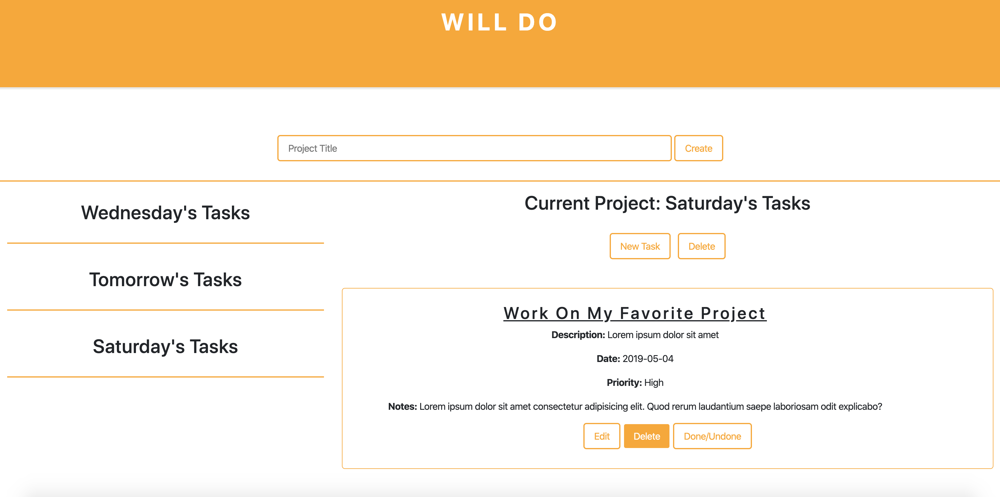

# Will Do

 

  

  <h2 align="center">Will Do</h2>

  

    JavaScript Project
     
     
    <a href="https://rawcdn.githack.com/Redvanisation/Todo-list/dc95cf18d1646a2121fb6912f485c7c5dc69f3f3/dist/index.html" target="_blank">View Demo</a>
    ·
    <a href="https://github.com/Redvanisation/Todo-list/issues">Report Bug</a>
    ·
    <a href="https://github.com/Redvanisation/Todo-list/issues">Request Feature</a>
  

<!-- TABLE OF CONTENTS -->
## Table of Contents

* [About the Project](#about-the-project)
  * [Built With](#built-with)

<!-- ABOUT THE PROJECT -->
## About The Project

Based on the [The Todo List](https://www.theodinproject.com/courses/javascript/lessons/todo-list) in the odin project as a part of the Microverse curriculum.

The purpose is to get a good understanding how persistent data can be stored on the browser using [localStorage](https://developer.mozilla.org/en-US/docs/Web/API/Window/localStorage).

The following are actions that can be done on the application.
  1. Create a new project.
  2. Add tasks for the selected project.
  3. Edit tasks for a particular project.
  4. Clear all the data in the [localStorage](https://developer.mozilla.org/en-US/docs/Web/API/Window/localStorage).

### Built With
* [JavaScript](https://www.javascript.com/)
* [webpack](https://webpack.js.org/)

### Contact

* [Radouane Khiri](https://github.com/Redvanisation) - [Linkedin](https://www.linkedin.com/in/redvan/) - [Twitter](https://twitter.com/redvanisation)
* [Anthony Tapia Cossio](https://github.com/AnthonyTC89) - [Linkedin](linkedin.com/in/anthony-tapia-cossio) - [Twitter](https://twitter.com/ptonypTC)
